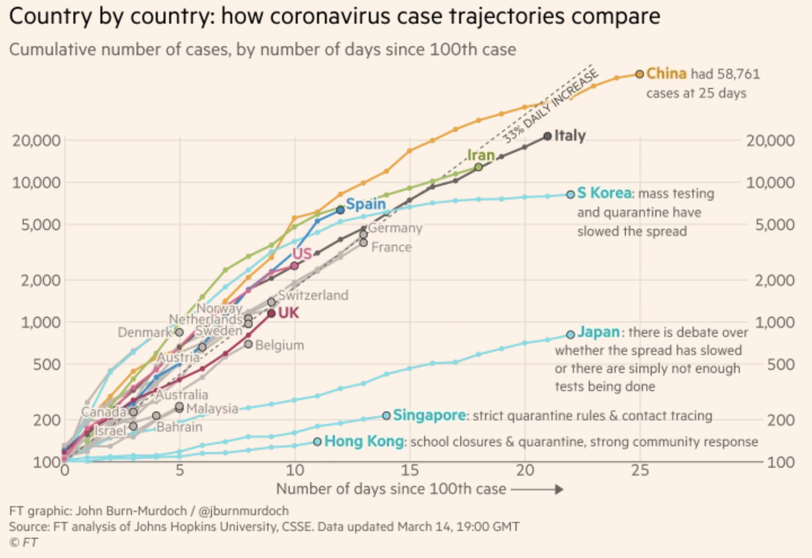

[](https://gitter.im/covid19-healthsystemcapacity/community?utm_source=badge&utm_medium=badge&utm_campaign=pr-badge)

## TL;DR Summary

Understand, anticipate, and act to support and ramp up our local health systems' capacity (providers, supplies, ventilators, beds, meds) to effectively care for a rapidly growing flow of active COVID19 patients. 

Open-source data collection, geospatial analysis, visualizations, and scenario-planning tools informing decisionmaking and resource deployment to support our healthcare providers at local, county, & state scale when and where the needs are greatest. USA-centric at the moment but tools and knowhow are intended to be applicable globally.

Let's #FlattenTheCurve and raise our capacity to care for COVID19 patients (and everyone else who needs medical care!) here and now.

**High level project goals:**

A. Publish a public dataset that describes the US healthcare system capacity in high spatiotemporal detail.

B. Perform an analysis of the healthcare system capacity as compared to disease spread forecasts and publish data about where, when, and how large capacity gaps are anticipated to be.

C. Visualize the result of the analysis as well as the disease forecast and healthcare system capacity data in a format that supports healthcare system preparedness and resourcing decisions.


## Why


Source: https://twitter.com/alxrdk/status/1237021885239635969

You've likely seen some version of this #FlattenTheCurve diagram. Look at the orange lines. The dashed orange line represents "Treatment capacity without action" and the solid orange line is "Treatment capacity with delay". In other graphics, this is often shown as a flat line labeled as "Health Systems Capacity". 

Notice how these lines dip or grow differently between the fast+high peaking patient needs scenario vs the flattened patient needs scenario. The change in the line reflects our healthcare system responding to the growing crisis. We can increase care capacity by clearing and diverting non-urgent/elective cases, bringing in more providers, setting up and staffing normally unused beds and ventilators, releasing stockpiled supplies and receiving more, etc. In China's case, they built 2 new hospitals dedicated to COVID19 patients and sent 10s of thousands of health providers from other areas of China into Wuhan (citation TODO). But there are hard limits to how high capacity can grow as signified by the line's plateaui. 

More importantly, see how capacity dips with high+fast peaking demand on health systems. This happens because [health systems become overwhelmed](https://www.theatlantic.com/ideas/archive/2020/03/who-gets-hospital-bed/607807/) by rapidly surging #s of active patients in need and their ability to effectively care for them deteriorates. Beds get filled up and stay occupied longer, supplies run low, there aren't enough ventilators or other critical care equipment to go around, [providers get exhausted or exposed to COVID19 and taken out of work by quarantine, sickness, or death](https://www.businessinsider.com/healthcare-workers-getting-coronavirus-500-infected-2020-2).

Fast growing demand and dipping capacity means  care, especially for critically ill patients, can quickly become a scarce resource that needs to be triaged, as described by [researchers of what is now happening in Italy](https://www.thelancet.com/journals/lancet/article/PIIS0140-6736(20)30627-9/fulltext):

>The percentage of patients in intensive care reported daily in Italy between March 1 and March 11, 2020, has consistently been between 9% and 11% of patients who are actively infected. The number of patients infected since Feb 21 in Italy closely follows an exponential trend. If this trend continues for 1 more week, there will be 30 000 infected patients. Intensive care units will then be at maximum capacity; up to 4000 hospital beds will be needed by mid-April, 2020.

>In theory, we are in a better position than many other countries to react to the current outbreak. However, an aggressive approach needs to be taken with patients who are critically ill with SARS-CoV-2, often including ventilatory support. The system's capacity to respond to changing circumstances has been under enormous pressure, at least in the Lombardy region, where two clusters have already emerged since Feb 21. We predict that if the exponential trend continues for the next few days, more than 2500 hospital beds for patients in intensive care units will be needed in only 1 week to treat ARDS caused by SARS-CoV-2-pneumonia in Italy. In the meantime, the government is preparing to pass legislation that will enable the health service to hire 20 000 more doctors and nurses and to provide 5000 more ventilators to Italian hospitals. These measures are a step in the right direction, but our model tells us that they need to be implemented urgently, in a matter of days. Otherwise, a substantial number of unnecessary deaths will become inevitable. Intensive care specialists are already considering denying life-saving care to the sickest and giving priority to those patients most likely to survive when deciding who to provide ventilation to.

A health system's ability to handle a rapid surge of patients with minimal capacity loss and ramp up to an higher overall capacity for care is a question that depends, among other things, on where and when. While [new cases are being reported every day in new places across the globe](https://www.arcgis.com/apps/opsdashboard/index.html#/bda7594740fd40299423467b48e9ecf6) and [estimates that 20-60% of the adult population may ultimately be infected](https://news.harvard.edu/gazette/story/2020/03/hundreds-of-u-s-coronavirus-cases-may-have-slipped-through-screenings/) by the virus permeate the public's understanding, this spread is not evenly distributed in place nor time. 

Even considering disparities in covid19 testing capacity and lag between becoming infected and showing symptoms which delay or skew our understanding of the disease's true spatiotemporal distribution, outbreaks start in different places at different times and grow at different rates. Spread differs depending on how many cases were imported from elsewhere and when, an area's population density, age distributions and prevalence of health comorbidities, effectiveness and timing of early testing, containment, social distancing, or mitigation measures. In short, the slope of increase and peak of the demand curve can vary greatly in place and time.

This example of a pandemic's different impact on different communities is well studied in the 1918 Spanish Flu case of Philadelpha and St. Louis:


Source: [Quartz: This chart of the 1918 Spanish flu shows why social distancing works](https://qz.com/1816060/a-chart-of-the-1918-spanish-flu-shows-why-social-distancing-works/)

For COVID19 in China, drastic differences were seen comparing Wuhan (left figure) and Guangzhou (right figure). Note the difference of scale on the Y-axis:

<div float="left">
  
   
</div>

* Explanatory twitter thread: https://threadreaderapp.com/thread/1237347774951305216.html
* Paper: https://dash.harvard.edu/handle/1/42599304
* Data: https://github.com/c2-d2/COVID-19-wuhan-guangzhou-data

### Take-home message #1:
Social distancing works and is among the best practices we have on hand to slow the case growth rate, lower the peak demand, and flatten the curve so that our health systems have enough time to ramp up and the volume of cases doesn't exceed their capacity to provide effective care. Know what to do and do your part to protect yourself and your community with these resources:
- [Flatten The Curve](https://www.flattenthecurve.com/)
- [CDC: How To Prepare and Take Action](https://www.cdc.gov/coronavirus/2019-ncov/community/index.html)

### Take-home message #2:
Our health system capacity is at great risk of being saturated or overwhelmed. If you look again at the above figure for Wuhan at their peak of active severely ill and critically ill cases, the # of critically ill (patients who require ICU-level care) per capita hits the US' number of ICU beds per capita. 

**In other words, if the USA on average has a similar experience as Wuhan, we would completely fill all of our ICUs with COVID19 patients.** Note that our ICUs typically operate at around 70% occupancy (or higher in a particularly bad flu season) which means everyone else who typically needs to be in ICU may be displaced, critically ill COVID patients may not get an ICU bed or level of care, or both. The USA is very much on the COVID case growth trajectory of [Italy who is facing not a wave, but a tsunami of patients](https://www.pbs.org/newshour/health/not-a-wave-a-tsunami-italy-hospitals-at-virus-limit). 


Source: [Financial Times](https://www.ft.com/content/a26fbf7e-48f8-11ea-aeb3-955839e06441)

How prepared are our health systems? How do we prepare?

[One set of recommendations circulated widely](http://www.centerforhealthsecurity.org/cbn/2020/cbnreport-02272020.html) give these priorities for hospital preparedness:

>Individual hospitals and groups of hospitals involved in regional coordination of pandemic preparedness should focus their initial preparedness efforts in the following priority areas: 
> 1. Comprehensive and realistic planning based on actual CDC FluSurge projections in each hospital, and collaborative planning among all hospitals in a region (eg, healthcare coalitions).
> 2. Limiting the nosocomial spread of the virus to (1) protect the healthcare workers and, thus, maintain a hospital workforce; (2) prevent the hospital from being a disease amplifier; and (3) protect the non–COVID-19 patients from infection, so as to maintain the ability to provide essential non–COVID-19 health care.
> 3. Maintaining, augmenting, and stretching the hospital workforce.
> 4. Allocating limited healthcare resources in a rational, ethical, and organized way so as to do the greatest good for the greatest number.

Further down under "Specific Priority Action Items To Be Taken", we see clear opportunities to support the ability of health systems to dramatically ramp up capacity guided by better data and local/regional coordination:

> * Participate in a local healthcare coalition, which includes neighboring hospitals, local public health agencies, and emergency management. Members of multi-hospital health systems should integrate system-wide planning with local planning with other local hospitals.
> * We do not yet have modeling tools or planning assumptions for COVID-19. CDC has developed [FluSurge 2.0](https://www.cdc.gov/flu/pandemic-resources/tools/flusurge.htm), which can be used in conjunction with HHS planning assumptions to guide planning for both a moderate and severe pandemic.3 Note that the default assumptions in FluSurge are based on a 1968-like pandemic. To model a severe pandemic, FluSurge allows the assumed number of hospitalizations to be modified to correspond to the HHS planning assumptions for a severe pandemic.
> * Be able to make 30% of licensed bed capacity available for COVID-19 patients on 1 week’s notice. About 10-20% of a hospital’s bed capacity can be mobilized within a few hours by expediting discharges, using discharge holding areas, converting single rooms to double rooms, and opening closed areas, if staffing is available. Another 10% can be obtained within a few days by converting flat spaces, such as lobbies, waiting areas, and classrooms.4
> * Collaborate in regional plans to be able to make at least 200% of licensed bed capacity in the region available for COVID-19 patients on 2 weeks’ notice.

More:
- [What does the coronavirus mean for the U.S. health care system? Some simple math offers alarming answers](https://www.statnews.com/2020/03/10/simple-math-alarming-answers-covid-19/)
- [Here’s the Biggest Thing to Worry About With Coronavirus](https://www.nytimes.com/2020/03/12/upshot/coronavirus-biggest-worry-hospital-capacity.html)
- [U.S. Hospitals Prepare for Coronavirus, With the Worst Still to Come](https://www.nytimes.com/2020/03/12/us/hospitals-coronavirus.html)

What does peak case load (demand) and health system capacity (supply) look like on a more granular spatial level?

In the same study above, researchers estimate the number of critically ill patients at Wuhan-like COVID19 peak demand in the USA population of different cities accounting for differences in local patient demographics (how many are 65+ in age or how many have hypertension):


The paper cites the US national average for ICU beds as 2.80 per 10,000 adults (15+) and the % of empty beds being 31.8%. With these high-level numbers in mind, our health system capacity - particularly critical care/ICU with an assumption that 100% of capacity is made available for COVID19 patients - will be strained close to or past its max in every city shown in figure 3. 

What is the actual critical care capacity in each city or region? How much is capacity ramping in preparation health system by health system? How much past 100% capacity will the demand be? When and how quickly will this happen in different areas? How do we minimize this gap as much and as proactively as possible? 

Getting closer to these answers relies on knowing more granularly in time and place the health system capacity of a city, county, state, and region. We could use inpatient and ICU bed availability as rough proxies to provide decisionmakers with more concrete, actionable awareness of current and foreseeable gaps between demand and supply. What is the capacity gap currently in a particular location and how might it grow or shrink over time under different scenarios of mitigating disease spread (lowering demand) and deploying limited healthcare resources (raising supply).

Finding out, anticipating, and addressing this healthcare systems capacity gap is what this project is about. We need to:

1. know the baseline capacity of healthcare systems to enough granularity for localized decisionmaking at the city, county, and state levels.
2. map how capacity responds in place and time to the anticipated spatiotemporal distribution of COVID19 spread
3. assess our potential and progress in ramping up capacity where needed
4. identify where and how care gaps remain as proactively as possible
5. prioritize deployment of more resources to where it needs to be the most to relieve overstrained health systems and minimize deterioriation of care for patients.

Help us get going. There's no more time to wait.

## What To Do

1. Know the baseline capacity of healthcare systems to enough granularity for localized decisionmaking at the city, county, and state levels:
  
    1.1: Amass healthcare facilities, beds, care utilization, provider data from national, state, county data sources:
        
    * National (CMS HCRIS cost reporting data):
        * https://www.cms.gov/files/document/2018-mdcr-providers-4.pdf
        * https://www.cms.gov/research-statistics-data-systems/provider-services-current-files/2019-pos-file
        * https://www.resdac.org/articles/medicare-cost-report-data-structure
    * NY: 
        * https://health.data.ny.gov/Health/Health-Facility-Map/875v-tpc8
        * https://health.data.ny.gov/Health/Adult-Care-Facility-Directory/wssx-idhx
        * https://health.data.ny.gov/Health/Health-Facility-Certification-Information/2g9y-7kqm
    * CA: 
        * https://healthdata.gov/dataset/licensed-and-certified-healthcare-facility-bed-types-and-counts
    * NJ: 
        * https://www.nj.gov/cgi-bin/dhss/healthfacilities/hospitaldisplay.pl?id=10402
    * MA:
        * https://www.mass.gov/service-details/find-information-about-licensed-or-certified-health-care-facilities

    1.2: Clean-up and bring together into data-science ready formats:
    
    * Jupyter Notebooks: [/nbs](./nbs/)
    * GeoJSON, spreadsheets, & other data produced: [/data](./data/)

    1.3: Visualizations and Dashboards: 
    
    * 1st attempt here (**DISCLAIMER:** Data has been sanity-checked at a high level to be in the right ballpark but errors are present and more rigorous data validation and clean-up is needed): 
    
    Interactive: [https://daveluo.github.io/covid19-healthsystemcapacity/viz/covid19-usabedcapacity-geoviz20200313v1](https://daveluo.github.io/covid19-healthsystemcapacity/viz/covid19-usabedcapacity-geoviz20200313v1)

    

2. Map how capacity responds in place and time to the anticipated spatiotemporal distribution of COVID19 spread:

    TODO: currently an incomplete and messy info/links dump, to be re-organized:

    2.1: tracking cases/testing:
    * http://coronavirusapi.com/
    * https://covidtracking.com/
    * https://projects.sfchronicle.com/2020/coronavirus-map/
    * https://www.nytimes.com/interactive/2020/us/coronavirus-us-cases.html
    * https://github.com/pcm-dpc/COVID-19
    * https://scarpino.shinyapps.io/Emergent_Epidemics_Lab_nCoV2019/?mkt_tok=eyJpIjoiWmpFMVpEY3pZalk0WVRNMyIsInQiOiJvWGl2RnhkRDZaOHpGcVVSNGhyT2JxWVJcLzdIdVBFam96b3MxZFM2WkdKT09PK1wvTm5Jb1loMzNLMVl2TUhDb05cL0tMUVM1ZzBtUnpvTWY2bjdocW8rb1JGSXlpejZsXC96TGhpVHNvXC95NzhKcGd0dkF2K2dFNlZySmt1QTZzaWVyIn0%3D
    * http://virological.org/t/epidemiological-data-from-the-ncov-2019-outbreak-early-descriptions-from-publicly-available-data/337/2
    * https://avatorl.org/covid-19/
    * https://nextstrain.org/narratives/ncov/sit-rep/2020-03-13
    
    2.2: epi modeling:
    * https://my.causal.app/models/1432
    * http://deim.urv.cat/~alephsys/COVID-19/spain/es/index.html
    * https://www.lshtm.ac.uk/research/centres/centre-mathematical-modelling-infectious-diseases
    * http://scratch.neherlab.org/about
    * https://institutefordiseasemodeling.github.io/COVID-public/
    * https://www.technologyreview.com/s/615360/cdc-cmu-forecasts-coronavirus-spread/

3. Assess our potential and progress in ramping up capacity where needed
 
4. Identify where and how care gaps remain as proactively as possible

5. Prioritize deployment of more resources to where it needs to be the most to relieve overstrained health systems and minimize deterioriation of care for patients.

## How To Help

- lots of data to science*:
  - ingesting new data and cleaning up things
  - validation and error checking, 
  - spatial and temporal analyses at different scales
  - combining with other datasets like covid case counts by day/county/state, this is maybe the best one for the US right now: https://covidtracking.com/
  - visualizations and information design that's much better than what I can do
  - basic to advanced epi modeling would be really helpful to project out # of active cases putting demand on the healthcare system in different locations at different times. Ideally broken out to the individual county level but statewide works too. 
    - Something like this [SIR model](https://en.wikipedia.org/wiki/Compartmental_models_in_epidemiology#The_SIR_model) would be a great start: https://neherlab.org/covid19/
    - and/or: https://institutefordiseasemodeling.github.io/COVID-public/
    - and/or: https://cmmid.github.io/topics/covid19/current-patterns-transmission/global-time-varying-transmission.html
    - and/or we could design our data to be easily inputted into CDC's [Flu Surge 2.0](https://www.cdc.gov/flu/pandemic-resources/tools/flusurge.htm) Excel-based model or something similar that is already familar to and in use by hospital admin.
- user feedback and validation
  - connecting with decisionmakers and validating the usefulness of what's being produced here. Maybe that user or decisionmaker is you!
- communication and education - what and why are these tools important for personal & community protection, public health decisionmaking at the local, county & state levels
  - public awareness building and truth-seeking to detect problems and implore action where it's most needed. Focus on creating actionable awareness and avoid paralysis by analysis, panic, despair. 
- project management...enough said.
- ask great questions
  - about how some part or all of this project works or more importantly, is useful
  - where to avoid reinventing the wheel and use what's already built and useful out there
  - how to connect and coordinate with related efforts
- what else...you tell us! Or better yet, take what's here and run with it, build on it, make it work for your community. Let us know what you come up with so we can link to it and learn from you. Let's build and share expertise together!

Grab the data, run the notebooks, ask questions, flag an issue, comment anywhere, send a pull request, join the gitter chat:

[](https://gitter.im/covid19-healthsystemcapacity/community?utm_source=badge&utm_medium=badge&utm_campaign=pr-badge)

### \*Running the notebooks

You can run the Jupyter notebooks for data processing and analytics directly on your machine by using [Docker](https://docs.docker.com/install/).

To get started you can use these scripts (requires non-Windows OS with a Docker installation):

```
> ./docker/build
> ./docker/run
```

This will print out a URL with a token parameter to open up in your browser.
Use the last one listed (starting with `http://127.0.0.1:8888`)

The docker container will mount the notebooks and data folder into the container, so that any notebook
work is saved to the `nbs/` folder on your machine, and an data moved into the `data/` folder will be accessable
through `/opt/jupyter/data` inside any notebook.

Developing inside a docker container keeps track of what dependencies the notebooks need to run.
All required libraries to run notebooks should be placed in `nbs/requirements.txt`.

## Methodology Notes (things get messy here)

1.1:

Following this [paper's methodology](https://www.ncbi.nlm.nih.gov/pmc/articles/PMC4351597/), I grabbed every US health facility that reported cost data to Medicare in FY2018 (via CMS' Healthcare Cost Reporting Info Sys or [HCRIS](https://www.cms.gov/Research-Statistics-Data-and-Systems/Downloadable-Public-Use-Files/Cost-Reports)), ran their addresses through geocoders to get point lngs/lats per facility, and grabbed their reported bed counts (Medical ICU, Cardiac ICU, Burn ICU, Surg ICU, General adult+peds, Total beds)

Calculated bed occupancy rates by dividing total inpt days / total available bed days across the reporting year

Spatial joined with US county polygons, summed bed counts, joined US 2018 census population data, calculated beds/1000 people and beds/1000 15+ year olds

**Known issues with this approach:**
- a bed as defined in HCRIS (nicely tucked away on page 62 of [Chapter 40](https://www.cms.gov/Regulations-and-Guidance/Guidance/Manuals/Downloads/P152_40.zip) of the [Provider Reimbursement Manual](https://www.cms.gov/Regulations-and-Guidance/Guidance/Manuals/Paper-Based-Manuals-Items/CMS021935), see below for excerpt) is what gets staffed across the reporting year, not the total # of physically available beds or licensed beds ([more about these bed distinctions](https://esf8.dhh.la.gov/documentportal/Download/Public/Definitions%20of%20Bed%20Poll%20Terms.pdf))

>A bed means an adult bed, pediatric bed, portion of inpatient labor/delivery/postpartum (LDP) room (also referred to as birthing room) bed when used for services other than labor and delivery, or newborn ICU bed (excluding newborn bassinets) maintained in a patient care area for lodging patients in acute, long term, or domiciliary areas of the hospital. Beds in post-anesthesia, post- operative recovery rooms, outpatient areas, emergency rooms, ancillary departments (however, see exception for labor and delivery department), nurses' and other staff residences, and other such areas that are regularly maintained and utilized for only a portion of the stay of patients (primarily for special procedures or not for inpatient lodging) are not termed a bed for these purposes. (See CMS Pub. 15-1, chapter 22, §2205.)

- which means the bed counts here are lower end of the range for total potential bed capacity, although it should be a good baseline of what "business as usual" hospital capacity has been in recently years
- total and ICU bed counts also doesn't distinguish between adult or peds. We could categorize all beds from childrens' hospitals as peds and/or estimate adult beds based on the overall proportion of adult vs peds beds across a county or state
- another set of national numbers on beds and other facility stats could come from the AHA: 
  - https://www.aha.org/system/files/2018-07/2018-aha-chartbook.pdf
  - https://www.aha.org/statistics/fast-facts-us-hospitals
- or on a state level, by the licensing reports filed with each DOH, i.e. for California: https://healthdata.gov/dataset/licensed-and-certified-healthcare-facility-bed-types-and-counts
    - note that these are licensed bed counts as opposed to staffed beds. Licensed bed count =  100% capacity for a facility


## Sources

TODO

## Acknowledgments

TODO

## Misc
