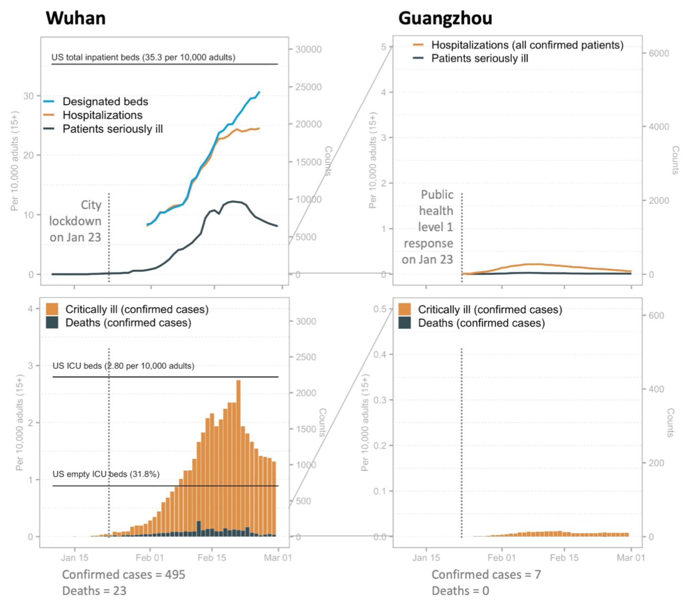
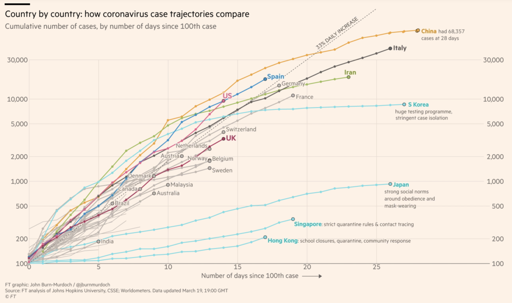
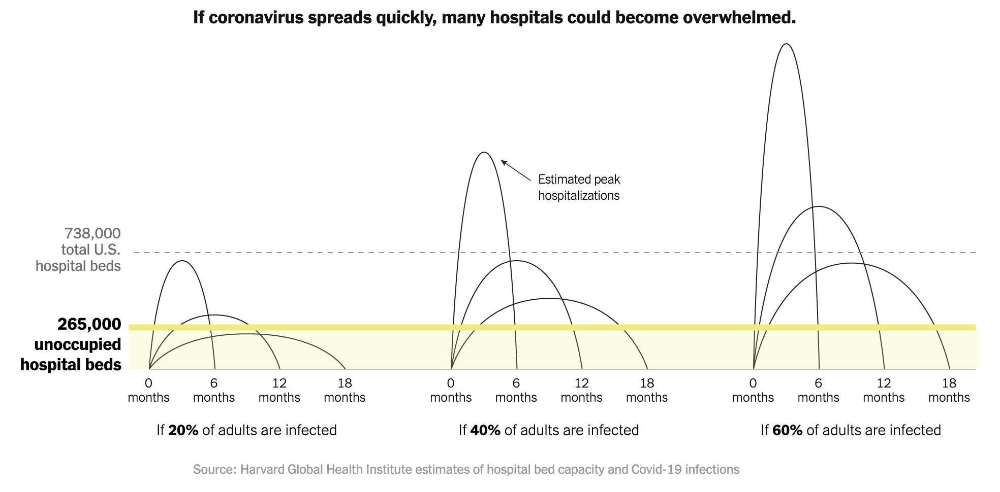
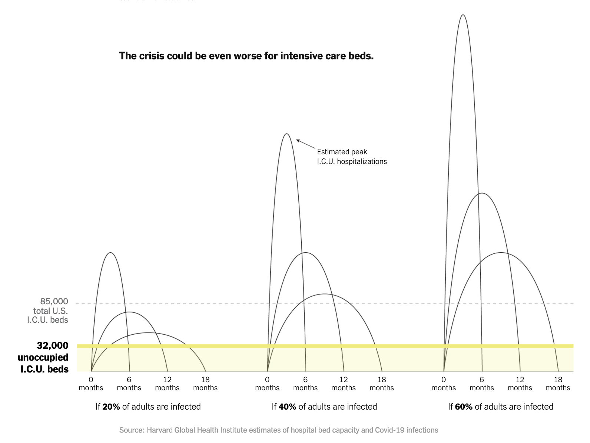
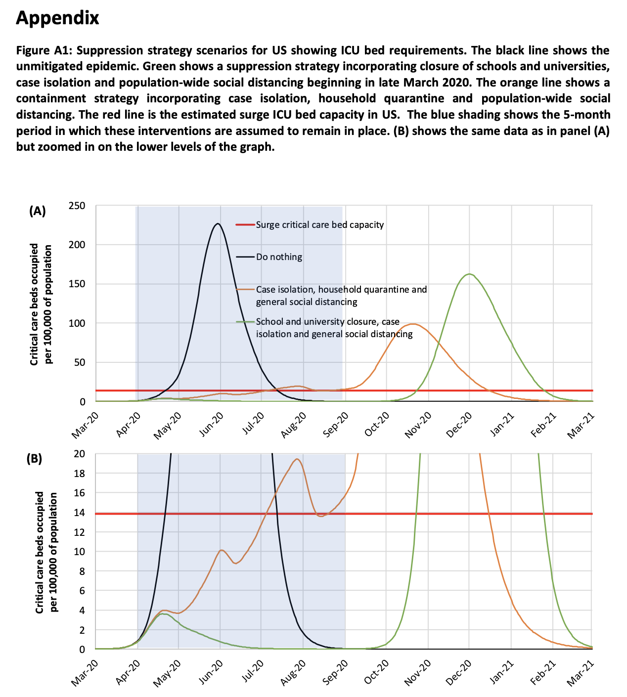
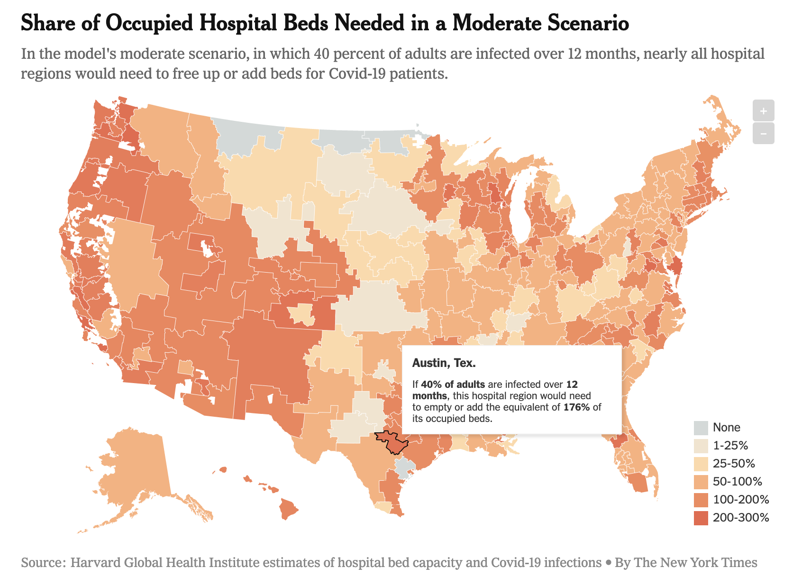
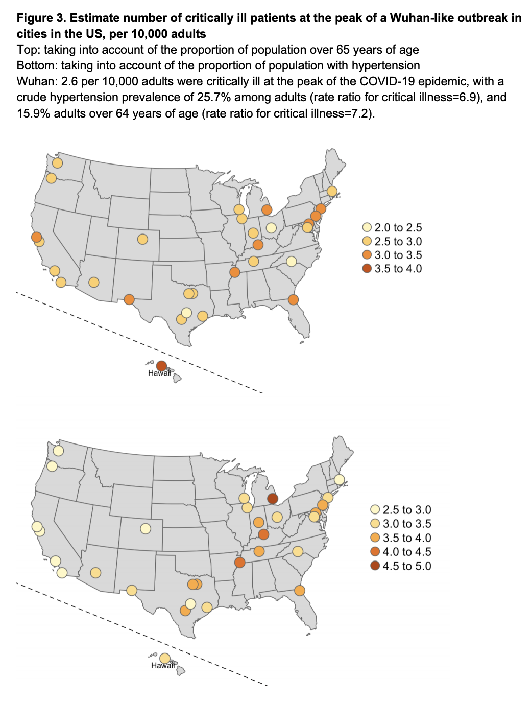
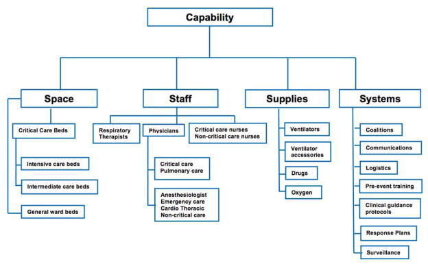

[](https://gitter.im/covid19-healthsystemcapacity/community?utm_source=badge&utm_medium=badge&utm_campaign=pr-badge)


- [TL;DR](#tl;dr)
- [Overview](#overview)
- [Data](#data)
- [Maps and Visualizations](#maps-and-visualizations)
- [Contributing](#contributing)
- [Why](#why)
  - [Take-home Message #1](#take-home-message-1)
  - [Take-home Message #2](#take-home-message-2)
- [What To Do](#what-to-do)
- [How To Help](#how-to-help)
- [Developing COVIDCareMap](#developing-covidcaremap)
  - [Getting Started](#getting-started)
  - [Using Docker](#using-docker)
  - [Repository Organization](#repository-organization)
  - [Running the notebooks](#running-the-notebooks)
  - [Building the map](#building-the-maps)
  - [Deployment](#deployment)
- [Glossary of Terms](#glossary-of-terms)
- [Acknowledgments](#acknowledgments)
- [Methodology Notes](#methodology-notes)
- [Sources](#sources)


## TL;DR

Mapping existing and forecasted health system capacity gaps (beds, staffing, ventilators, supplies) to care for surging numbers of COVID19 patients (especially ICU-level care) at high spatiotemporal resolution (by facility, daily, all USA to start).

## Overview

This project aims to understand, anticipate, and act to support and ramp up our health systems' capacity (beds, staffing, ventilators, supplies) to effectively care for a rapidly growing number of active COVID19 patients in need of hospitalization and intensive (ICU) care.

We do open-source data collection, geospatial analysis, visualizations, and scenario-planning tools aimed at informing resource planning and deployment decisionmaking to support our healthcare providers at local, county, & state scale when and where the needs are greatest. USA-centric at the moment but tools and knowhow are intended to be applicable globally.

Let's #FlattenTheCurve and raise our capacity to care for COVID19 patients (and everyone else who needs medical care!) here and now.

**High level project goals:**

A. Publish a public dataset that describes the US healthcare system capacity in high spatiotemporal detail.

B. Perform an analysis of the healthcare system capacity as compared to disease spread forecasts and publish data about where, when, and how large capacity gaps are anticipated to be.

C. Visualize the result of the analysis as well as the disease forecast and healthcare system capacity data in a format that supports healthcare system preparedness and resourcing decisions.

## Data

Published data can be found in the [data/published](https://github.com/covidcaremap/covid19-healthsystemcapacity/tree/master/data/published) folder. This data include:

| File                                                 | Description                                                                   |
|------------------------------------------------------|-------------------------------------------------------------------------------|
| [us_healthcare_capacity-facility-CovidCareMap.geojson](data/published/us_healthcare_capacity-facility-CovidCareMap.geojson) | Capacity information for US Health Facilities in GeoJSON format. [Data Dictionary](data/README.md#covidcaremap-capacity-data-dictionary)|
| [us_healthcare_capacity-facility-CovidCareMap.csv](data/published/us_healthcare_capacity-facility-CovidCareMap.csv) | Capacity information for US Health Facilities in CSV format. [Data Dictionary](data/README.md#covidcaremap-capacity-data-dictionary)|
| [us_healthcare_capacity-county-CovidCareMap.geojson](data/published/us_healthcare_capacity-county-CovidCareMap.geojson)   | Aggregated facility capacity information by County in GeoJSON format. [Data Dictionary](data/README.md#covidcaremap-capacity-data-dictionary)|
| [us_healthcare_capacity-county-CovidCareMap.csv](data/published/us_healthcare_capacity-county-CovidCareMap.csv)   | Aggregated facility capacity information by County in CSV format. [Data Dictionary](data/README.md#covidcaremap-capacity-data-dictionary)|
| [us_healthcare_capacity-state-CovidCareMap.geojson](data/published/us_healthcare_capacity-state-CovidCareMap.geojson)    | Aggregated facility capacity information by State in GeoJSON format. [Data Dictionary](data/README.md#covidcaremap-capacity-data-dictionary)|
| [us_healthcare_capacity-state-CovidCareMap.csv](data/published/us_healthcare_capacity-state-CovidCareMap.csv)    | Aggregated facility capacity information by State in CSV format. [Data Dictionary](data/README.md#covidcaremap-capacity-data-dictionary)|
| [us_healthcare_capacity-hrr-CovidCareMap.geojson](data/published/us_healthcare_capacity-hrr-CovidCareMap.geojson)      | Aggregated facility capacity information by Healthcare Referral Region (HRR) in GeoJSON format. [Data Dictionary](data/README.md#covidcaremap-capacity-data-dictionary)|
| [us_healthcare_capacity-hrr-CovidCareMap.csv](data/published/us_healthcare_capacity-hrr-CovidCareMap.csv)      | Aggregated facility capacity information by Healthcare Referral Region (HRR) in CSV format. [Data Dictionary](data/README.md#covidcaremap-capacity-data-dictionary)|

See the Published Datasets section in [data/README.md](data/README.md#published-datasets) for more information.

### Using Tags

**IMPORTANT NOTE:** The data in this repository will be updated to rapidly iterate towards the most informative, current, and complete data possible. While things like field names shouldn't change (besides adding columns), if you want to point to consistent data, we highly suggest using a tagged version of the repository, which will not change.

Tagged versions of the repository are below. Click on the link and browse to the data file you want to use from

| Version                                                 | Notes                                                                   |
|------------------------------------------------------|-------------------------------------------------------------------------------|
| [v0.1 Data Release](https://github.com/covidcaremap/covid19-healthsystemcapacity/tree/v0.1/data) | Initial release of CovidCareMap.org US Healthcare System Capacity data |

## Maps and Visualizations

Check out the [list of visualizations here](https://www.covidcaremap.org/viz/index.html)

### Contributing Visualizations

If you have a visualization using our data, or any geospatial data related to the COVID-19 criss,
CovidCareMap.org would love to host it! You can contribute static HTML pages, or sites that compile
to static html pages, by making a PR against this repository. Or, if your visualization is hosted
elsewhere, please write an issue or make a PR to add a card to the visualization listing page.

### Ventilator Supply and Healthcare Capacity Map, by State

[https://www.covidcaremap.org/maps/hghi-vents/](https://www.covidcaremap.org/maps/hghi-vents/)

This map combines [health capacity data](https://globalepidemics.org/2020/03/17/caring-for-covid-19-patients/) from the Harvard Global Health Institute and ventilator supply estimates from a [2010 study](https://www.ncbi.nlm.nih.gov/pubmed/21149215).

### US Healthcare System Capacity

[https://www.covidcaremap.org/maps/us-healthcare-system-capacity/](https://www.covidcaremap.org/maps/us-healthcare-system-capacity/)

This map visualizes the [CovidCareMap.org US Healthcare System Capacity](covidcaremap-us-healthcare-system-capacity-data).

## Contributing

See [CONTRIBUTING.md](CONTRIBUTING.md) for information on how to contribute!

## Why


Source: https://twitter.com/alxrdk/status/1237021885239635969

You've likely seen some version of this #FlattenTheCurve diagram. Look at the orange lines. The dashed orange line represents "Treatment capacity without action" and the solid orange line is "Treatment capacity with delay". In other graphics, this is often shown as a flat line labeled as "Health Systems Capacity".

Notice how these lines dip or grow differently between the fast+high peaking patient needs scenario vs the flattened patient needs scenario. The change in the line reflects our healthcare system responding to the growing crisis. We can increase care capacity by clearing and diverting non-urgent/elective cases, bringing in more providers, setting up and staffing normally unused beds and ventilators, releasing stockpiled supplies and receiving more, etc. In China's case, they built 2 new hospitals dedicated to COVID19 patients and sent 10s of thousands of health providers from other areas of China into Wuhan (citation TODO). But there are hard limits to how high capacity can grow as signified by the line's plateau.

More importantly, see how capacity dips with high+fast peaking demand on health systems. This happens because [health systems become overwhelmed](https://www.theatlantic.com/ideas/archive/2020/03/who-gets-hospital-bed/607807/) by rapidly surging #s of active patients in need and their ability to effectively care for them deteriorates. Beds get filled up and stay occupied longer, supplies run low, there aren't enough ventilators or other critical care equipment to go around, [providers get exhausted or exposed to COVID19 and taken out of work by quarantine, sickness, or death](https://www.businessinsider.com/healthcare-workers-getting-coronavirus-500-infected-2020-2).

Fast growing demand and dipping capacity means care, especially for critically ill patients, can quickly become a scarce resource that needs to be triaged, as described by [researchers of what is now happening in Italy](<https://www.thelancet.com/journals/lancet/article/PIIS0140-6736(20)30627-9/fulltext>):

> The percentage of patients in intensive care reported daily in Italy between March 1 and March 11, 2020, has consistently been between 9% and 11% of patients who are actively infected. The number of patients infected since Feb 21 in Italy closely follows an exponential trend. If this trend continues for 1 more week, there will be 30 000 infected patients. Intensive care units will then be at maximum capacity; up to 4000 hospital beds will be needed by mid-April, 2020.

> In theory, we are in a better position than many other countries to react to the current outbreak. However, an aggressive approach needs to be taken with patients who are critically ill with SARS-CoV-2, often including ventilatory support. The system's capacity to respond to changing circumstances has been under enormous pressure, at least in the Lombardy region, where two clusters have already emerged since Feb 21. We predict that if the exponential trend continues for the next few days, more than 2500 hospital beds for patients in intensive care units will be needed in only 1 week to treat ARDS caused by SARS-CoV-2-pneumonia in Italy. In the meantime, the government is preparing to pass legislation that will enable the health service to hire 20 000 more doctors and nurses and to provide 5000 more ventilators to Italian hospitals. These measures are a step in the right direction, but our model tells us that they need to be implemented urgently, in a matter of days. Otherwise, a substantial number of unnecessary deaths will become inevitable. Intensive care specialists are already considering denying life-saving care to the sickest and giving priority to those patients most likely to survive when deciding who to provide ventilation to.

A health system's ability to handle a rapid surge of patients with minimal capacity loss and ramp up to an higher overall capacity for care is a question that depends, among other things, on where and when. While [new cases are being reported every day in new places across the globe](https://www.arcgis.com/apps/opsdashboard/index.html#/bda7594740fd40299423467b48e9ecf6) and [estimates that 20-60% of the adult population may ultimately be infected](https://news.harvard.edu/gazette/story/2020/03/hundreds-of-u-s-coronavirus-cases-may-have-slipped-through-screenings/) by the virus permeate the public's understanding, this spread is not evenly distributed in place nor time.

Even considering delays in COVID19 testing capacity and the lag time between becoming infected and showing symptoms or becoming ill which delay or skew our understanding of the disease's true spatiotemporal distribution, outbreaks still start in different places at different times and grow at different rates. COVID19's spread and impact differs depending on an area's population density, age distributions and prevalence of health comorbidities, ow many cases are imported from elsewhere, effectiveness and timing of early testing, containment, social distancing, and other mitigation/suppression measures. In short, the slope of increase and peak of the demand curve can vary greatly in place and time.

A pandemic's differing impact on different cities taking different measures taken is well studied in the 1918 Spanish Flu case of Philadelphia and St. Louis:


Source: [Quartz: This chart of the 1918 Spanish flu shows why social distancing works](https://qz.com/1816060/a-chart-of-the-1918-spanish-flu-shows-why-social-distancing-works/)

In [Li, et al](https://dash.harvard.edu/handle/1/42599304)'s research on China's current experience with COVID19, similarly large differences were seen comparing patient hospitalization and critical illness rates in Wuhan (left) and Guangzhou (right). Note the large difference of scale on the Y-axis:



- Paper preprint: https://dash.harvard.edu/handle/1/42599304
- Explanatory twitter thread: https://threadreaderapp.com/thread/1237347774951305216.html
- Data: https://github.com/c2-d2/COVID-19-wuhan-guangzhou-data

We can also see different case growth trajectories at the country level. The USA is very much on the COVID19 trajectory of [Italy who is facing not a wave, but a tsunami of patients](https://www.pbs.org/newshour/health/not-a-wave-a-tsunami-italy-hospitals-at-virus-limit).


Source: [Financial Times, updated Mar 19, 2020](https://www.ft.com/content/a26fbf7e-48f8-11ea-aeb3-955839e06441)

### Take-home Message #1

[Social distancing and shelter-at-home policies work](https://twitter.com/ASlavitt/status/1241583932472274946) and [are urgently needed everywhere there's COVID19](https://covidactnow.org/) to slow the case growth rate, lower the peak demand, and flatten the curve so that our health systems have enough time to ramp up and the volume of cases doesn't exceed their capacity to provide effective care.

Know what to do and do your part to protect yourself, your healthcare providers, and your community with these resources:

- [Stay Home, Save Lives](https://www.stayhomesavelives.us/)
- [Flatten The Curve](https://www.flattenthecurve.com/)
- [CDC: How To Prepare and Take Action](https://www.cdc.gov/coronavirus/2019-ncov/community/index.html)

### Take-home Message #2

Our health system capacity is at risk of being overwhelmed. If you look again at the above figure for Wuhan at their peak of active severely ill and critically ill cases, the # of critically ill (patients who require ICU-level care) per capita nearly reaches the US' number of ICU beds per capita.

**In other words, if the USA on average has a similar experience as Wuhan, we would completely fill all of our ICU beds with COVID19 patients.**

Note that our ICUs typically operate at around 70% occupancy (or up to 90% in a particularly bad flu season) which means critically ill COVID patients (or non-COVID patients who need it) may not get ICU  level of care due to lack of available beds or staffing or equipment.

How prepared are our health systems? How do we prepare?

[One set of recommendations circulated widely](http://www.centerforhealthsecurity.org/cbn/2020/cbnreport-02272020.html) give these priorities for hospital preparedness:

> Individual hospitals and groups of hospitals involved in regional coordination of pandemic preparedness should focus their initial preparedness efforts in the following priority areas:
>
> 1. Comprehensive and realistic planning based on actual CDC FluSurge projections in each hospital, and collaborative planning among all hospitals in a region (eg, healthcare coalitions).
> 2. Limiting the nosocomial spread of the virus to (1) protect the healthcare workers and, thus, maintain a hospital workforce; (2) prevent the hospital from being a disease amplifier; and (3) protect the non–COVID-19 patients from infection, so as to maintain the ability to provide essential non–COVID-19 health care.
> 3. Maintaining, augmenting, and stretching the hospital workforce.
> 4. Allocating limited healthcare resources in a rational, ethical, and organized way so as to do the greatest good for the greatest number.

In the section on "Specific Priority Action Items To Be Taken", we see clear opportunities to support the ability of health systems to dramatically ramp up capacity guided by better data and local/regional coordination:

> - Participate in a local healthcare coalition, which includes neighboring hospitals, local public health agencies, and emergency management. Members of multi-hospital health systems should integrate system-wide planning with local planning with other local hospitals.
> - We do not yet have modeling tools or planning assumptions for COVID-19. CDC has developed [FluSurge 2.0](https://www.cdc.gov/flu/pandemic-resources/tools/flusurge.htm), which can be used in conjunction with HHS planning assumptions to guide planning for both a moderate and severe pandemic.3 Note that the default assumptions in FluSurge are based on a 1968-like pandemic. To model a severe pandemic, FluSurge allows the assumed number of hospitalizations to be modified to correspond to the HHS planning assumptions for a severe pandemic.
> - Be able to make 30% of licensed bed capacity available for COVID-19 patients on 1 week’s notice. About 10-20% of a hospital’s bed capacity can be mobilized within a few hours by expediting discharges, using discharge holding areas, converting single rooms to double rooms, and opening closed areas, if staffing is available. Another 10% can be obtained within a few days by converting flat spaces, such as lobbies, waiting areas, and classrooms.4
> - Collaborate in regional plans to be able to make at least 200% of licensed bed capacity in the region available for COVID-19 patients on 2 weeks’ notice.

How will health systems planning to

> "Be able to make 30% of licensed bed capacity available for COVID-19 patients on 1 week’s notice"

and

> "Collaborate in regional plans to be able to make at least 200% of licensed bed capacity in the region available for COVID-19 patients on 2 weeks’ notice."

meet up with our current best estimates of the growing and peak patient needs for hospitalization and critical care?

In just-out work by the [Harvard Global Health Institute](https://globalepidemics.org/2020/03/17/caring-for-covid-19-patients/) (with stories and visualizations by the [NYTimes](https://www.nytimes.com/interactive/2020/03/17/upshot/hospital-bed-shortages-coronavirus.html), [ProPublica](https://projects.propublica.org/graphics/covid-hospitals)), they found that across a range of plausible scenarios where the US adult population is infected by COVID19 (20%, 40%, 60%) and how long the demand curve can be flattened out (epidemic lasting 6 months, 12 months, or 18 months) the demand at peak could surge past the number of US hospital beds (unoccupied or total depending on the scenario):



And even more so for ICU care - going possibly several multiples past existing available and total capacity (unoccupied and total US ICU beds):


In epidemiologic modeling work by [Ferguson, et al](https://www.imperial.ac.uk/media/imperial-college/medicine/sph/ide/gida-fellowships/Imperial-College-COVID19-NPI-modelling-16-03-2020.pdf) which has [informed and shifted the USA's response at the national level](https://www.nytimes.com/2020/03/16/us/coronavirus-fatality-rate-white-house.html), they simulated various [non-pharmaceutical intervention](https://www.paho.org/disasters/index.php?option=com_docman&view=download&category_slug=tools&alias=530-pandinflu-leadershipduring-tool-4&Itemid=1179&lang=en) scenarios where governments implement different types and combinations of disease mitigation and suppression measures (i.e. closing schools, general social distancing, isolating known cases) to see how this affects timing and hight of the demand curve (in terms of critical care beds occupied per capita). Their analysis shows an overshoot of "surge critical care bed capacity" (red line) by several multiples in any of their scenarios and more than 15x in the "Do nothing" scenario:



What does peak case load (demand) and health system capacity (supply) look like on a more granular spatial level?

In that same Harvard Global Health Institute analysis above, they estimate demand curves and bed capacity needs under those same scenarios for hospital facilities grouped by [Hospital Referral Regions](https://www.arcgis.com/home/item.html?id=62969fa5bc3c4e3abd045cd62332c58c) in order to compare regional differences in potential health system capacity gaps. They found large differences between regions (from within capacity in some regions to 2-3x over capacity in others under the Moderate scenario):


[Interactive visualization link](https://www.nytimes.com/interactive/2020/03/17/upshot/hospital-bed-shortages-coronavirus.html)

In the study by [Li, et al](https://dash.harvard.edu/handle/1/42599304) described earlier, they also estimate the number of critically ill patients at Wuhan-like peak demand in the USA population of different cities by accounting for local differences in demographics (how many are 65+ in age or how many have hypertension). The paper cites the US national average for ICU beds as 2.80 per 10,000 adults (15+) and the % of empty beds being 31.8% for a business-as-usual available ICU bed capacity of 0.9 beds per 10,0000 adults. With these high-level numbers in mind, our health system capacity - specifically ICU care, even if we freed up 100% of ICU beds for COVID19 patients - would be pushed close to or past its max capacity in every city studied:



What is the current care capacity (particularly ICU care) in each facility, city, county or region? By how much can capacity feasibly ramp up in a facility, health system, or region? When and how quickly can this happen in different areas? Is it enough to meet forecasted patient demand? If not, from where and how we do make new capacity available?

From a [2015 study](https://www.ncbi.nlm.nih.gov/pmc/articles/PMC4636910/) to model the "capacity of the healthcare system to use additional mechanical ventilators during a large-scale public health emergency (PHE)" by representatives of multiple federal health agencies (FDA, HHS, CDC), they identified 4 key components needed for effective mechanical ventilation (MV), a key part of delivering effective ICU care in particular for COVID19 patients:



We can start answering these care capacity questions by collecting reported total inpatient and ICU bed availability (and typical bed occupancy rates) and estimating them for facilities where the data is not available. This gives us a better understanding of currently available space ("Critical Care Beds" in the above figure). Using ratios, percentages, and absolute estimates for staffing and supplies based on the number of ICU beds needed for different scenarios in [critical care surge capacity planning](https://journal.chestnet.org/article/S0012-3692(15)51987-9/fulltext#cesec30), we can model the potential increase in critical care capacity for a given facility or area at different surge care levels ([Conventional, Contingency, Crisis](https://marlin-prod.literatumonline.com/cms/attachment/2119285238/2091674456/gr1_lrg.jpg)). This table from the same vent capacity study shows how many ICU patients can potentially be treated at different levels of surge care (increasing additional providers, higher staffing ratios and more converted-to-ICU beds) on a national level:


We can make similar estimations for potential ICU bed capacity at the facility, city, county, state levels under these surge care levels. Then we can assess what staffing, vents, supplies, and other constraining resources need to be deployed to bring a health system or region to that capacity level. We can inform decisionmaking about resource allocations compared to other locations of need based on forecasted COVID19 case loads and relative capacity gaps.

Once we do this as a baseline, how do we dynamically track change and progress in ramping up capacity over time and place towards reaching levels needed to care for all patients in need? How do we proactively detect and deploy additional resources to where new capacity gaps emerge due to staffing loss or shortages of equipment and supplies?

Finding out, anticipating, and addressing this healthcare systems capacity gap is what this project is about. We need to:

1. know the baseline capacity of healthcare systems to enough granularity for localized decisionmaking at the city, county, and state levels.
2. map how capacity responds in place and time to the anticipated spatiotemporal distribution of COVID19 spread
3. assess our potential and progress in ramping up capacity where needed
4. identify where and how care gaps remain as proactively as possible
5. prioritize deployment of more resources to where it needs to be the most to relieve overstrained health systems and minimize deterioration of care for patients.

Help us get going. There's no more time to wait.

## What To Do

1. Know the baseline capacity of healthcare systems to enough granularity for localized decisionmaking at the city, county, and state levels:

   1.1: Amass healthcare facilities, beds, care utilization, provider data from national, state, county data sources:
    - [HCRIS Medicare cost reporting data](https://www.cms.gov/Research-Statistics-Data-and-Systems/Downloadable-Public-Use-Files/Cost-Reports)
    - [HIFLD hospital facilities data](https://hifld-geoplatform.opendata.arcgis.com/datasets/hospitals)
    - [Definitive Health hospital open data](https://www.arcgis.com/apps/opsdashboard/index.html#/8c4dcccd9e3845eb89f6401f919007f2)

   1.2: Clean-up and bring together into data-science ready formats:

    - [Jupyter Notebooks](https://github.com/daveluo/covid19-healthsystemcapacity/tree/master/nbs)
    - [GeoJSON, spreadsheets, & other data produced](https://github.com/daveluo/covid19-healthsystemcapacity/tree/master/data)

   1.3: Visualizations and Dashboards:

    - See [Visualizations Page](https://www.covidcaremap.org/viz/index.html)

2. Model and map potential capacity versus anticipated spatiotemporal distribution of COVID19 spread

   2.1: Model care capacity (supply)

   2.2: Model COVID19 patient case loads (demand)

3. Track/estimate progress in ramping up capacity in response/preparation for patient demand

   3.1: Design and create data correction/reporting/crowdsourcing systems to maintain as close to an real-time, verified dataset and understanding of healthsystem capacity at the facility level nationwide as possible

4. Identify where, when, and how large care capacity gaps remain and emerge

   4.1 Operationalized dashboards built on top of this dynamically updating health systems capacity and forecasted/reported case load data with scenario modeling tools to aid in rapid and proactive detection of hidden or emergent care gaps.

5. Prioritize deployment of more resources to where it needs to be the most to relieve overstrained health systems and minimize deterioration of care for patients.

  5.1 Visualizations and communications for decisionmakers at the facility, county, state, national levels to provide ongoing situational awareness of resourcing needs at the relevant scale (in their areas of responsibility).

## How To Help

- [Data gathering, cleaning, cataloging](https://github.com/daveluo/covid19-healthsystemcapacity/projects/1):
  - Researching and sourcing new data
  - Ingesting datasets and cleaning up things
  - Building data validation and error correction systems
  - Combining with other datasets like COVID19 case counts by day/county/state like from [covidtracking.com](https://covidtracking.com/)

- [Data analytics](https://github.com/daveluo/covid19-healthsystemcapacity/projects/2):
  - Spatial and temporal analyses at different scales
  - Capacity modeling for beds, staffing, supplies, equipment to provide effective ICU care in crisis levels. Current project work on:
    - [Staffing needs](https://github.com/covidcaremap/covid19-healthsystemcapacity/issues/18)
    - [Ventilator needs](https://github.com/covidcaremap/covid19-healthsystemcapacity/issues/17)
    - [Supply needs (PPEs)](https://github.com/covidcaremap/covid19-healthsystemcapacity/issues/45)
  - Basic to advanced epi modeling (or plugging into such work), i.e.:
    - [SIR model](https://en.wikipedia.org/wiki/Compartmental_models_in_epidemiology#The_SIR_model) for COVID19 scenarios like from [Neher Lab](https://neherlab.org/covid19/)
    - [SEIR model](https://github.com/alsnhll/SEIR_COVID19)
    - [Institute for Disease Modeling](https://institutefordiseasemodeling.github.io/COVID-public/)
    - [Centre for the Mathematical Modelling of Infectious Diseases](https://cmmid.github.io/topics/covid19/current-patterns-transmission/global-time-varying-transmission.html)
    - and/or we could design our data to be easily inputted into surge planning tools that are already familar and in use by health systems.

- [Visualizing, Designing, Communicating](https://github.com/daveluo/covid19-healthsystemcapacity/projects/3):
  - Visualizing and designing to inform decisionmaking
  - Connecting with users and validating the usefulness of what's being produced here. Maybe this user or decisionmaker is you!
  - Communicating and educating about what this data means and how they're important for supporting our healthcare systems, personal & community protection, public health decisionmaking at the local, county & state levels
  - Public awareness building and truth-seeking to highlight problems and implore action where it's most needed. Focus on creating actionable awareness and avoid paralysis by analysis, panic, despair.

- [Project Direction](https://github.com/daveluo/covid19-healthsystemcapacity/projects/4):
  - Managing different aspects of the project from volunteers to research to organization and documentation
  - Organizing ourselves and creating useful structure
  - Advising on matters of your expertise (healthcare provision, epidemiology, public health emergency response...)
  - Recommending and implementing new tools or practices for us to work better, faster
  - Asking great questions
    - about how some part or all of this project works or more importantly, is useful
    - where to avoid reinventing the wheel and use what's already built and useful out there
    - how to connect and coordinate with related efforts

- What else...you tell us! Or better yet, take what's here and run with it, build on it, make it work for your community. Let us know what you come up with so we can link to it and learn from you. Let's build and share expertise together!

Grab the data, run the notebooks, ask questions, flag an issue, comment anywhere, send a pull request, join the gitter chat:

[](https://gitter.im/covid19-healthsystemcapacity/community?utm_source=badge&utm_medium=badge&utm_campaign=pr-badge)

## Developing CovidCareMap

### Getting Started

After cloning the repository, build the docker container:

```
> docker/build
```

Start the Jupyter notebook server:

```
> docker/notebooks
```

Now open the link that was last output by the above command. The link should look something like
`http://127.0.0.1:8888/?token=2b39bb1d2a955bca4622e563fa50dc973016db70d23e0ae5`.
This will open a jupyter notebook file browser
that shows a `data` and `notebooks` folder.

Now navigate to the `00_getting_started` folder and run through the notebooks!

#### Data Processing

If you'll be working with data processing changes for the CovidCareMap.org us healtchare system capacity
dataset, you can follow these steps. Note that you do not need to do this in order to get started using
the notebooks for analytics.

Open the the [processing/00_Download_Data.ipynb](notebooks/processing/00_Download_Data.ipynb) notebook
to download any external data needed to run the other notebooks.

To run the other processing notebooks, read [notebooks/README.md](notebooks/README.md) which describes
what notebooks need to run in what order. Note the [processing/01_Geocode_CHRIS_Data.ipynb](notebooks/processing/01_Ceocode_HCRIS_Data.ipynb) requires a Google and Mapbox API key to be supplied. You don't need to run this notebook - the geocoded results are already supplied in the repository.

Getting started on building and editing the maps can be found in [viz/README.md](viz/README.md).

### Using Docker

The `docker/build` command builds a docker container called `covid19:latest`. This container can
run the jupyter notebook server, build the web map sites, and contains an environment that ensures
all required libraries or packges are installed for everyone.

If you contribute code that requires a specific package, please make sure it is built into the
docker container. This can include adding python packages to `notebooks/requirements.txt` as
well as adding `apt-get install` commands into the [Dockerfile](docker/Dockerfile).

### Repository Organization

    ├── data                   <- Data used in this project.
    │
    ├── notebooks              <- Jupyter notebooks.
    │
    ├── docker                 <- Folder containing scripts and files for running Docker.
    │
    ├── scripts                <- Bash utility scripts such as downloading data.
    │
    ├── requirements.txt       <- The requirements file for the covidcaremap python module.
    │
    └── covidcaremap           <- Source code for the covidcaremap python package.


See the [notebooks](notebooks/README.md) and [data](data/README.md) folder for more information.

### Running the notebooks

You can run the Jupyter notebooks for data processing and analytics directly on your machine by using [Docker](https://docs.docker.com/install/).

To get started you can use these scripts (requires non-Windows OS with a Docker installation):

```
> ./docker/build
> ./docker/notebook
```

This will print out a URL with a token parameter to open up in your browser.
Use the last one listed (starting with `http://127.0.0.1:8888`)

The docker container will mount the notebooks and data folder into the container, so that any notebook
work is saved to the `notebooks/` folder on your machine, and an data moved into the `data/`
folder will be accessable through `/opt/jupyter/data` inside any notebook. Also all
repository files are accessible through `/opt/src`.

Developing inside a docker container keeps track of what dependencies the notebooks need to run.
All required libraries to run notebooks should be placed in `nbs/requirements.txt`.

### Building the maps

To build the maps, run

```
> ./docker/build
> ./docker/generate-maps
```

Now if you commit the `maps` folder, you'll make edits to the `covidcaremap.org/maps` sites.
Make sure all data is placed correctly in the viz folders (i.e. run the notebook to [Process visualization data](notebooks#process-visualization-data).

### Deployment

Deployment of the site happens through GitHub pages. With write access to the repo, you can perform the following steps:

- Run through all the processing notebooks to produce fresh data, including the notebook to [Process visualization data](notebooks#process-visualization-data).
- Run `docker/generate-maps` to generate the maps.
- Commit the files, including the files in `maps/` which represent the static assets of the site.

Be sure to curate carefully the things you want to commit from the `maps/` folder. There could be some files produced or overriden that are build artifacts and shouldn't necessarily be committed. For instance, if youu are only
deploying US Healthcare System Capacity visualization changes, only commit the relevant changes in `maps/us-healthcare-system-capacity`.

You can do a final pass debug of the visualization by running `python -m http.server 9000` in the repositor root and navigating to the visualization you are testing, e.g. http://localhost:9000/maps/us-healthcare-system-capacity.


## Glossary of Terms

This project uses many healthcare-specific terms and acronyms. This brief glossary of terms is to provide a better understanding of the project and ensures everyone is speaking the same language. If you can add to or improve these definitions, please make a pull request, open an issue or chat about it on Gitter!

#### DH

Definitive Health. Used to refer to the [dataset here](https://coronavirus-resources.esri.com/datasets/definitivehc::definitive-healthcare-usa-hospital-beds), which contains facility-level information.

#### HCRIS

Healthcare Cost Report Information System (HCRIS). This is normally used to refer to the
healthcare system facility data. COVIDCareMap uses this data to determine facility information
such as Staffed Beds, Staffed ICU Beds, ICU Occupancy Rate, and more where this data is available.

Read more here: https://www.cms.gov/Research-Statistics-Data-and-Systems/Downloadable-Public-Use-Files/Cost-Reports/Hospital-2010-form

#### HRR

Hospital Referral Region (HRR), specifying a market within which people generally go to the same hospitals

## Acknowledgments

Much thanks to all contributors so far (by alphabetical order of first name):

- [Aaron Su, Azavea](https://www.azavea.com/about/teammate/aaron-su/)
- [Dave Luo, Anthropocene Labs](https://www.davidluo.com/)
- [Hector Castro, Azavea](https://www.azavea.com/about/teammate/hector-castro/)
- [Jeff Frankl, Azavea](https://www.azavea.com/about/teammate/jeff-frankl/)
- Lauren Moos
- [Matt McFarland, Azavea](https://www.azavea.com/about/teammate/matt-mcfarland/)
- [Rob Emanuele, Azavea](https://www.azavea.com/about/teammate/rob-emanuele/)
- [Simon Kassel, Azavea](https://www.azavea.com/about/teammate/simon-kassel/)
- [Zhuangfang NaNa Yi, Development Seed](https://developmentseed.org/team/zhuangfang-nana-yi/)

A special thank you to [Azavea](https://www.azavea.com/) and its [10% Time and Volunteer programs](https://www.azavea.com/about/) for enabling the rapid kickstart and acceleration of this project.


## Methodology Notes

TODO

## Sources

TODO Helping here to organize our rapidly growing collection of references and data assets would be much appreciated, see [issue](https://github.com/daveluo/covid19-healthsystemcapacity/issues/31)
