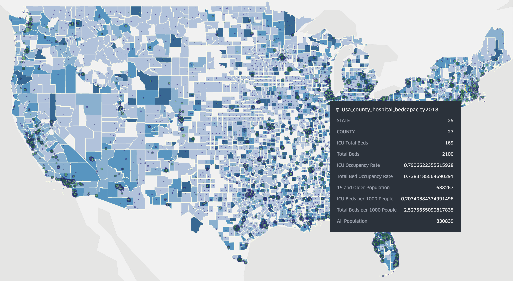

## TL;DR Summary

Understand, anticipate, and act to support and ramp up our local health systems' capacity (providers, supplies, ventilators, beds, meds) to effectively care for a rapidly growing flow of active COVID19 patients. 

Open-source data collection, geospatial analysis, visualizations, and scenario-planning tools informing decisionmaking and resource deployment to support our healthcare providers at local, county, & state scale when and where the needs are greatest. US-centric at the moment but tools and knowhow are intended to be applicable globally.

Let's #FlattenTheCurve and raise our capacity to care for COVID19 patients (and everyone else who needs medical care!) here and now.

## Why


Source: https://twitter.com/alxrdk/status/1237021885239635969

You've likely seen some version of this #FlattenTheCurve diagram. Look at the orange lines. The dashed orange line says "Treatment Capacity without action" and the solid orange line is "Treatment capacity with delay" (solid orange). In other graphics, this is often shown as a flat line labeled as "Health Systems Capacity". 

Notice how these lines dip and grow differently between the fast+high peaking caseload vs flattened caseload scenarios. The growth reflects our healthcare system's response to the growing crisis. They can increase capacity by clearing and diverting non-urgent/elective cases, bringing in more providers, setting up and staffing spare inpatient and ICU beds with ventilators, stockpiling and increasing supply shipments, etc. In China's case, they built 2 new hospitals dedicated to COVID19 patients and sent 10s of thousands of health providers from other areas of China into Wuhan (citation TODO). But there are hard limits to capacity growth as signified by the plateau. 

More importantly, see how capacity dips with high+fast peaking demand on health systems. This happens because [health systems become overwhelmed](https://www.theatlantic.com/ideas/archive/2020/03/who-gets-hospital-bed/607807/) by rapidly surging #s of active patients in need and deteriorate in their ability to effectively care for them. Beds get filled up and stay occupied longer, supplies run low, there aren't enough ventilators or other critical care equipment to go around, [providers get exhausted or exposed to COVID19 and taken out of work by quarantine, sickness, or death](https://www.businessinsider.com/healthcare-workers-getting-coronavirus-500-infected-2020-2).

A health system's ability to handle this surge of patients with minimal capacity dip and ramp up to an higher overall capacity for care is a very localized question. While [new cases are being reported every day in new places across the globe](https://www.arcgis.com/apps/opsdashboard/index.html#/bda7594740fd40299423467b48e9ecf6) and [estimates that 20-60% of the adult population may ultimately be infected](https://news.harvard.edu/gazette/story/2020/03/hundreds-of-u-s-coronavirus-cases-may-have-slipped-through-screenings/) by the virus permeate the public's understanding, this spread is not evenly distributed in place nor time. Even considering disparities in covid19 testing capacity and lag between becoming infected and showing symptoms which delay or skew our understanding of the disease's true spatiotemporal distribution, outbreaks start in different places at different times and grow at different rates. It differs depending on how many came from elsewhere and when, population density, distributions of age and/or health comorbidities, effectiveness of early testing and containment efforts, or social distancing and other mitigation measures put in place when and how aggressively. In short, the slope of increase and peak of the demand curve can vary greatly in place and time.

This example of the different infectious disease impact on different communities is well studied in the 1918 Spanish Flu case of Philadelpha and St. Louis:


Source: [Quartz: This chart of the 1918 Spanish flu shows why social distancing works](https://qz.com/1816060/a-chart-of-the-1918-spanish-flu-shows-why-social-distancing-works/)

For COVID19 in China, drastic differences were seen comparing Wuhan (left figure) and Guangzhou (right figure) provinces. Note the difference of scale on the Y-axis:

<div float="left">
  
   
</div>

* Explanatory twitter thread: https://threadreaderapp.com/thread/1237347774951305216.html
* Paper: https://dash.harvard.edu/handle/1/42599304
* Data: https://github.com/c2-d2/COVID-19-wuhan-guangzhou-data

### Take-home message #1:
Social distancing works and is among the best practices we have on hand to slow the case growth rate, lower the peak demand, and flatten the curve so that our health systems have enough time to ramp up and the volume of cases doesn't exceed their capacity to provide effective care. Know what to do and do your part to protect yourself and your community with these resources:
- [FlattenTheCurve](https://www.flattenthecurve.com/)
- [StayTheFuckHome](https://staythefuckhome.com/)

### Take-home message #2:
Our health system capacity is at great risk of being saturated or exceeded. If you look again at the above figure for Wuhan province at their peak of active severely ill and critically ill cases, the # of critically ill (patients who require ICU-level care) per capita hits the US' number of ICU beds per capita. 

**In other words, if the US on average has a similar experience as Wuhan, we would completely fill all of our ICUs with COVID19 patients.** Note that our ICUs typically operate at around 70% occupancy so this means everyone else who usually needs to be in ICU may be displaced, critically ill COVID patients may not get an ICU bed or level of care, or both. The US is very much on the growth trajectory of [Italy in facing not a wave, but a tsunami of patients](https://www.pbs.org/newshour/health/not-a-wave-a-tsunami-italy-hospitals-at-virus-limit). How prepared are we?
- https://www.statnews.com/2020/03/10/simple-math-alarming-answers-covid-19/
- https://www.npr.org/2020/03/06/812967454/u-s-hospitals-prepare-for-a-covid-19-wave

In the same study above, researchers look at the effect of COVID19 on the US population in different areas based on the underlying patient demographics (how many are 65+ in age or how many have hypertension) and estimate the potential peak caseload (number of critically ill patients) on a city by city level:


The paper cites the US national average for ICU beds as 2.80 per 10,000 adults (15+) and the # of empty beds being 31.8%. Using these high-level numbers, our health system capacity - particularly critical care/ICU assuming 100% of physical beds have been emptied and made available for COVID19 patients - will be strained close to or past its max in every city shown in figure 3. 

What is the actual critical care capacity in each city or region? How much is that capacity ramping in preparation? How much past 100% capacity will the demand be? How close (or past) the breaking point will we go? How do we minimize this gap as much and as proactively as possible? 

Getting closer to these answers relies on knowing more granularly in time and place the health system capacity of a city, county, state, or region. We could use total inpatient and ICU bed availability as rough proxies to provide decisionmakers with more concrete, actionable awareness of current and foreseeable gaps between demand and supply. What is the capacity gap currently in a particular location and how might it grow or shrink over time under different scenarios of mitigating disease spread (lowering demand) and deploying limited healthcare resources (raising supply).

Finding out, anticipating, and addressing this healthcare systems capacity gap is what this project is about. We need to:

1. know the baseline capacity of healthcare systems to enough granularity for localized decisionmaking at the city, county, and state levels.
2. map how capacity responds in place and time to the anticipated spatiotemporal distribution of COVID19 spread
3. assess our potential and progress in ramping up capacity where needed
4. identify where and how care gaps remain as proactively as possible
5. prioritize deployment of more resources to where it needs to be the most to relieve overstrained health systems and minimize deterioriation of care for patients.

Help us get going. There's no more time to wait.

## What To Do

1. Know the baseline capacity of healthcare systems to enough granularity for localized decisionmaking at the city, county, and state levels:
  
    1.1: Amass healthcare facilities, beds, care utilization, provider data from national, state, county data sources:
        
    * NY: 
        * https://health.data.ny.gov/Health/Health-Facility-Map/875v-tpc8
        * https://health.data.ny.gov/Health/Adult-Care-Facility-Directory/wssx-idhx
        * https://health.data.ny.gov/Health/Health-Facility-Certification-Information/2g9y-7kqm
    * CA: 
        * https://healthdata.gov/dataset/licensed-and-certified-healthcare-facility-bed-types-and-counts
    * NJ: 
        * https://www.nj.gov/cgi-bin/dhss/healthfacilities/hospitaldisplay.pl?id=10402
    * MA:
        * https://www.mass.gov/service-details/find-information-about-licensed-or-certified-health-care-facilities
    * National (CMS HCRIS reporting data):
        * https://www.cms.gov/files/document/2018-mdcr-providers-4.pdf
        * https://www.cms.gov/research-statistics-data-systems/provider-services-current-files/2019-pos-file
        * https://www.resdac.org/articles/medicare-cost-report-data-structure

    1.2: Clean-up and bring together into data-science ready formats:
    
    * Notebooks: [/nbs](./nbs/) TODO
    * GeoJSON, spreadsheets, & other data produced: [/data](./data/)

    1.3: Visualizations and Dashboards: 
    
    * 1st attempt: [https://daveluo.github.io/covid19-healthsystemcapacity/viz/covid19-usabedcapacity-geoviz20200313v1](https://daveluo.github.io/covid19-healthsystemcapacity/viz/covid19-usabedcapacity-geoviz20200313v1)
    
    

2. Map how capacity responds in place and time to the anticipated spatiotemporal distribution of COVID19 spread:

    TODO: currently a messy info/links dump, to be organized:

    2.1: tracking cases/testing:
    * http://coronavirusapi.com/
    * https://covidtracking.com/
    * https://projects.sfchronicle.com/2020/coronavirus-map/
    * https://www.nytimes.com/interactive/2020/us/coronavirus-us-cases.html
    * https://github.com/pcm-dpc/COVID-19
    * https://scarpino.shinyapps.io/Emergent_Epidemics_Lab_nCoV2019/?mkt_tok=eyJpIjoiWmpFMVpEY3pZalk0WVRNMyIsInQiOiJvWGl2RnhkRDZaOHpGcVVSNGhyT2JxWVJcLzdIdVBFam96b3MxZFM2WkdKT09PK1wvTm5Jb1loMzNLMVl2TUhDb05cL0tMUVM1ZzBtUnpvTWY2bjdocW8rb1JGSXlpejZsXC96TGhpVHNvXC95NzhKcGd0dkF2K2dFNlZySmt1QTZzaWVyIn0%3D
    * http://virological.org/t/epidemiological-data-from-the-ncov-2019-outbreak-early-descriptions-from-publicly-available-data/337/2
    * https://avatorl.org/covid-19/
    * https://nextstrain.org/narratives/ncov/sit-rep/2020-03-13
    
    2.2: epi modeling:
    * https://my.causal.app/models/1432
    * http://deim.urv.cat/~alephsys/COVID-19/spain/es/index.html
    * https://www.lshtm.ac.uk/research/centres/centre-mathematical-modelling-infectious-diseases
    * http://scratch.neherlab.org/about
    * https://institutefordiseasemodeling.github.io/COVID-public/

3. Assess our potential and progress in ramping up capacity where needed
4. Identify where and how care gaps remain as proactively as possible
4. Prioritize deployment of more resources to where it needs to be the most to relieve overstrained health systems and minimize deterioriation of care for patients.

## How To Help

- lots of data to science*:
  - ingesting new data and cleaning up things
  - validation and error checking, 
  - spatial and temporal analyses at different scales
  - combining with other datasets like covid case counts by day/county/state, this is maybe the best one for the US right now: https://covidtracking.com/
  - visualizations and information design that's much better than what I can do
  - basic to advanced epi modeling would be really helpful to project out # of active cases putting demand on the healthcare system in different locations at different times. Ideally broken out to the individual county level but statewide works too. 
    - Something like this [SIR model](https://en.wikipedia.org/wiki/Compartmental_models_in_epidemiology#The_SIR_model) would be a great start: https://neherlab.org/covid19/
    - and/or: https://institutefordiseasemodeling.github.io/COVID-public/
    - and/or: https://cmmid.github.io/topics/covid19/current-patterns-transmission/global-time-varying-transmission.html
- user feedback and validation
  - connecting with decisionmakers and validating the usefulness of what's being produced here. Maybe that person's you!
- communication and education - what and why are these tools important for personal & community protection, public health decisionmaking at the local, county & state levels
  - public awareness building and truth-seeking to detect problems and implore action where it's most needed. Focus on creating actionable awareness and avoid paralysis by analysis, panic, despair. 
- project management...enough said.
- what else...you tell us! Or better yet, take what's here and run with it, build on it, make it work for your community. Let us know what you come up with so we can link to it and learn from you. Let's build and share expertise together!

Grab the data, run the notebooks, ask questions, flag an issue, comment anywhere, send a pull request, join the gitter chat:

[](https://gitter.im/covid19-healthsystemcapacity/community?utm_source=badge&utm_medium=badge&utm_campaign=pr-badge)

### \*Running the notebooks

You can run the Jupyter notebooks for data processing and analytics directly on your machine by using [Docker](https://docs.docker.com/install/).

To get started you can use these scripts (requires non-Windows OS with a Docker installation):

```
> ./docker/build
> ./docker/run
```

The docker container will mount the notebooks and data folder into the container, so that any notebook
work is saved to the `nbs/` folder on your machine, and an data moved into the `data/` folder will be accessable
through `/home/jovyan/data` inside any notebook.

Developing inside a docker container keeps track of what dependencies the notebooks need to run.
All required libraries to run notebooks should be placed in `nbs/requirements.txt`.

## Methodology Notes (things get messy here)

1.1:  

Following this [paper's methodology](https://www.ncbi.nlm.nih.gov/pmc/articles/PMC4351597/), I grabbed every US health facility that reported cost data to Medicare in FY2018 (via CMS' Healthcare Cost Reporting Info Sys or [HCRIS](https://www.cms.gov/Research-Statistics-Data-and-Systems/Downloadable-Public-Use-Files/Cost-Reports)), ran their addresses through geocoders to get point lngs/lats per facility, and counted up their various reported bed capacities (ICU, adult+peds, Total beds)

calculated bed occupancy rates by dividing total inpt days / total available bed days across the reporting year

spatial joined with US county polygons, summed bed counts, joined US 2018 census population data, calculated beds/1000 people and beds/1000 15+ year olds

got some really messy jupyter notebooks and using kepler to visualize for speed's sake

## Sources

## Acknowledgments

## Misc
