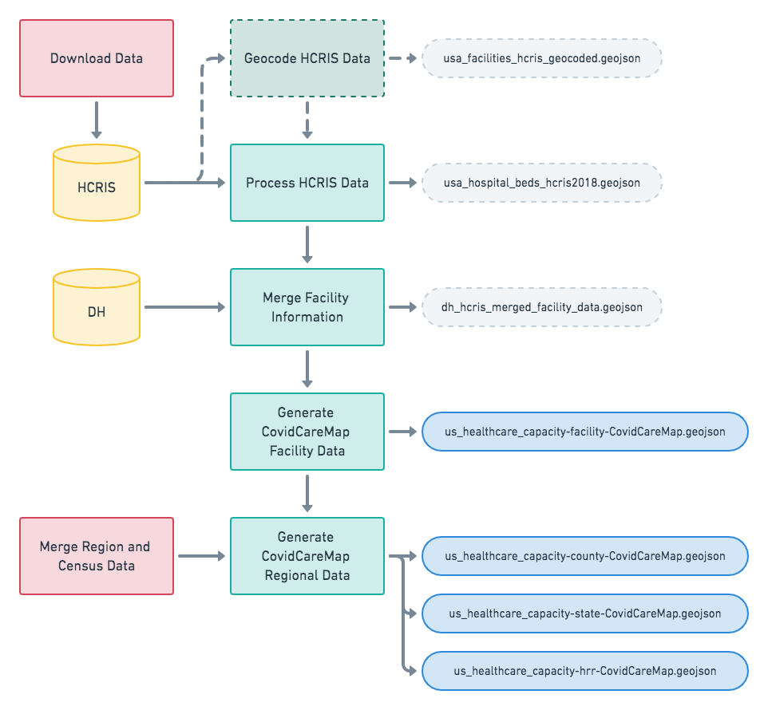

# Notebooks for the CovidCareMap.org Project

    └── notebooks              <- Jupyter notebooks.
        ├── README.md          <- This file.
        ├── 00_getting_started <- Start here!
        ├── requirements.txt   <- Python packages required to run notebooks.
        ├── old                <- Old notebooks such as previous versions of processing logic.
        ├── examples           <- Notebooks containing examples for using COVIDCareMap data.
        ├── processing         <- Notebooks for processing COVIDCareMap data.
        └── validation         <- Notebooks for validating COVIDCareMap data.

- [00_gettting_started](#00_getting_started)
- [Validation](#Validation)
- [Data Processing](#data-processing)

### 00_getting_started

This directory contains notebooks that show how to work COVID Care Map.
Run through them in order to get oriented with the data we've collected and what you can do with it!
Also a good place to pull snippets of code from for your own analysis.

### Validation

Notebooks to validate the data produced by CovidCareMap.org. Please contribute notebooks to help make sure
we have the most accurate data possible!

##### Notebooks

- [Check_CCM_against_HGHI.ipynb](Check_CCM_against_HGHI.ipynb): Notebook for validating CCM-HSC data against the HGHI data. Must run the notebooks to [process the HGHI data](#hghi-data) before running.

## Data Processing

**Note**: To ensure all notebooks have the data they need, make sure you run
[processing/00_Download_Data.ipynb](processing/00_Download_Data.ipynb) first.

These notebooks perform the data processing steps in order to generate the published CovidCareMap.org data
as well any other dataset produced by the project.

### Note!

Users who are not trying to recreate data produced by CovidCareMap.org do not have to run these
notebooks. The data that are generated by these notebooks are committed to the repository; if you
want to make changes to how the data are produced or want to dig into the methodology, these notebooks
are for you. If you're looking for ways to consume and analyze the data, you can look to the example
notebooks for guidance.

### Generating CovidCareMap.org Healthcare System Capacity (CCM-HSC) data

This workflow combines HCRIS, DH, US Census, ventilator data, and geocoding results to generate the [CovidCareMap US Healthcare System Capacity](../data/README.md#covidcaremap-us-healthcare-system-capacity-data) data. The following sections describe steps of that workflow, diagrammed above, which are encapsulated into a sequence of Jupyter notebooks. Each step has it's own notebook, and each notebook contains information about how the data is being derived. We present the data generation methods in this way to maximize transparency and knowledge transfer and to allow anyone to read through and spot issues or guide improvements to methodology.

#### Geocode HCRIS Data

This notebook geocodes the HCRIS data based on the address fields. It uses Google's geocoding API, with MapBox's geocoding as a backup when the Google API fails. We do it this way because we find that Google's API
is more accurate.

**Note:** This notebooks take a while to run, can fail with API errors, and has the geocoded data already committed to the repository, so it is not necessary to run.

#### Process HCRIS Data

This notebook joins together multiple HCRIS data sources to derive information about hospital beds. The
notebook contains detailed method information. The notebook produces a HCRIS GeoJSON dataset by
merging in with the geocoded points from above. The notebook calculates ICU bed counts and
occupancy rates based on the inpatient days and bed days available from the reports of various
types of ICU beds: Intensive Care Unit, Coronary Care Unit, Burn ICU, and Surgical ICU beds.

#### Merge Facility Information

This notebook merges the facility information from the HCRIS and DH datasets.
Future work will include merging more facility level datasets, for example HIFLD.
The HCRIS data is merged into DH; that is, DH facility names and location is considered
definitive and instances where there are DH facilities but no HCRIS facilities are kept, and
HCRIS facilities with no matching DH facilities are dropped. The matching methods are an
area that needs improvement [HELP WANTED](../README.md#contribiting)

#### Generate CovidCareMap Facility Data

This notebook generates the final published CovidCareMap.org US Healthcare System Capacity data
at the facility level. We do this by making using the merged DH and HCRIS data to make the best
estimation of the field values (see the [Data Dictionary](../data/README.md#covidcaremap-capcity-data-dictionary)).
There is a set of columns with a "- SOURCE" suffix that describe the dataset and column of where that
value was generated from, if available.

##### Data Override

You can add overridden facility data by doing the following:
- Place the CSV of facility information that has overridden values in [data/external/covidcaremap-ushcsc-facility-manual-override.csv](../data/README.md#covidcaremaporg-us-healthcare-system-capacity---manual-override)
- This data needs to be in the format as the published CovidCareMap facility data.
  - All fields must be the same as the data except those which are overridden.
  - Include two extra columns at the end: `Manual Override Reason` and `Manual Override New Data Source`
  - If you generate a new ID for CCM_ID, make sure it is unique to the dataset.
- Now running this notebook will replace or add the facility information.

#### Merge Region and Census Data

This step takes census data per county and merges it with county, state, and HRR regions. The HRR population calculation performs a spatial join betwee the HRRs and counties, and adds the county populations weighted by the overlapping area between the county and the HRR. The state data includes Puerto Rico census data taken from a different source than the county data. All population data are using the US Census 2018 estimates.

#### Generate CovidCareMap Regional Data

This notebook aggregates the facility data into bed counts, ratios and per-capita numbers for
counties, states, and HRRs. For states, it is also merged with [ventilator data](../data/README.md#ventilator-data).
The regioal aggregation uses logic contained in the `sum_per_region` method of [covidcaremap/geo.py](../covidcaremap/geo.py).

#### Process visualization data

This notebook will generate the vector tiles needed to run the `us-healthcare-system-capacity` visualization.

##### Notebooks

- [processing/01_Geocode_HCRIS_Data.ipynb](processing/01_Geocode_HCRIS_Data.ipynb)
- [processing/02_Process_HCRIS_Data.ipynb](processing/02_Process_HCRIS_Data.ipynb)
- [processing/03_Merge_Facility_Information.ipynb](processing/03_Merge_Facility_Information.ipynb)
- [processing/04_Generate_CovidCareMap_Facility_Data.ipynb](processing/04_Generate_CovidCareMap_Facility_Data.ipynb)
- [processing/05_Merge_Region_and_Census_Data.ipynb](processing/05_Merge_Region_and_Census_Data.ipynb)
- [processing/06_Generate_CovidCareMap_Regional_Data.ipynb](processing/06_Generate_CovidCareMap_Regional_Data.ipynb)
- [processing/07_Process_visualization_data.ipynb](processing/07_Process_visualization_data.ipynb)

### CareModel Data

**Note:** This data is a work in progress; it is not yet totally worked out and validated. Help wanted! More information is contained in the notebooks.

##### Notebooks

- [processing/Generate_CCM_CareModel_Facility_Data.ipynb](processing/Generate_CCM_CareModel_Facility_Data.ipynb): Generates CareModel data for facilities in the CCM-HSC data.
- [processing/Generate_CareModel_Regional_Data.ipynb](processing/Generate_CareModel_Regional_Data.ipynb): Aggregates CareModel data for US counties, states, and HRRs.

### HGHI Data

These notebooks process the [Harvard Global Health Institute (HGHI) Data](https://globalepidemics.org/2020/03/17/caring-for-covid-19-patients/). This processing generates the data used in the [Ventilator Supply and Healthcare Capacity Map, by State](https://www.covidcaremap.org/maps/hghi-vents/) visualization.

##### Notebooks

Must be run in this order:

- [processing/Process_HGHI_Data.ipynb](processing/Process_HGHI_Data.ipynb): Generates GeoJSON for the HGHI data.
- [processing/Merge_Ventilator_and_HGHI_State_Data.ipynb](processing/Merge_Ventilator_and_HGHI_State_Data.ipynb): Merges he HGHI data with the [ventilator data](../data/README.md#ventilator-data)
- [processing/Merge_HGHI_and_CCM_data.ipynb](processing/Merge_HGHI_and_CCM_data.ipynb): Merges CovidCareMap Healthcare System Capacity data and HGHI data.
